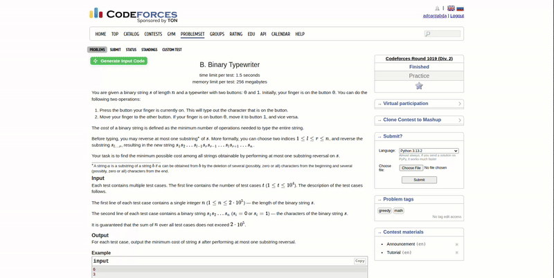

<p align="center">
  
  <h1 align="center">CPInput - Competitive Programming Input Generator</h1>
  <p align="center">
    <strong>Automate input parsing for competitive programming problems</strong>
  </p>
  <p align="center">
    <a href="https://github.com/adnantabda/cp-input-code-generator/releases">
      
    </a>
    <a href="https://github.com/adnantabda/cp-input-code-generator/blob/main/LICENSE">
      
    </a>
    <a href="https://github.com/adnantabda/cp-input-code-generator/issues">
      
    </a>
    <a href="https://github.com/yourusername/CPInput/pulls">
      
    </a>
  </p>
</p>

## 🌟 Features

- 🚀 **Instant Input Generation**: Convert problem statements to ready-to-use Python code in one click
- 🔍 **Smart Pattern Recognition**: Handles complex input formats including:
  - Single/multiple test cases
  - Arrays and matrices
  - Space/comma-separated values
  - Mixed input types
- 📋 **Copy-Paste Ready**: Clean, optimized code output
- 🧩 **Extensible Architecture**: Easy to add support for new languages or formats

## 📸 Demo

  
*Automatically generating input code from a Codeforces problem statement*

## 🛠 Installation

### Chrome Web Store (Recommended)
1. Visit [Chrome Web Store listing](#) (coming soon)
2. Click "Add to Chrome"
3. Pin the extension for easy access

### Manual Installation
```bash
git clone https://github.com/adnantabda/cp-input-code-generator.git
cd cp-input-code-generator
```
## 🧪 Example

**Input Description:**
> The first line contains a single integer t — the number of test cases.  
> Each test case contains three space-separated integers a, b and c.

**Generated Python Code:**
```python
t = int(input())
for _ in range(t):
    a, b, c = map(int, input().split())
